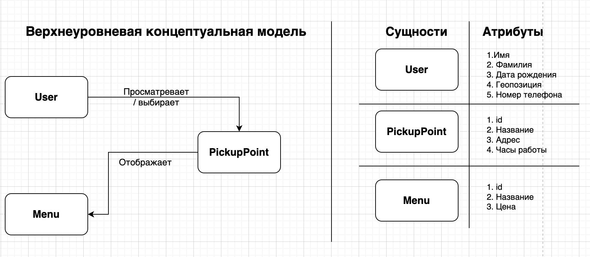
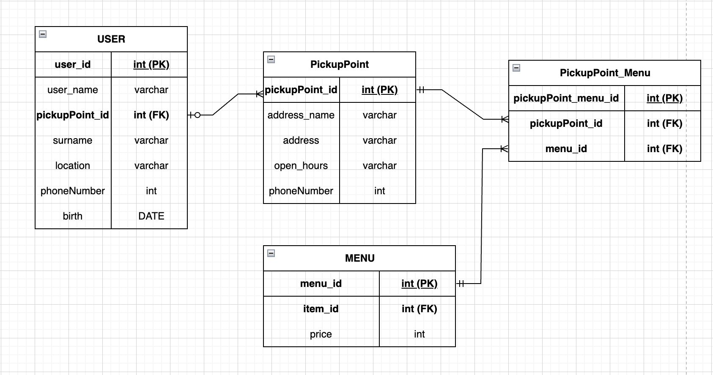
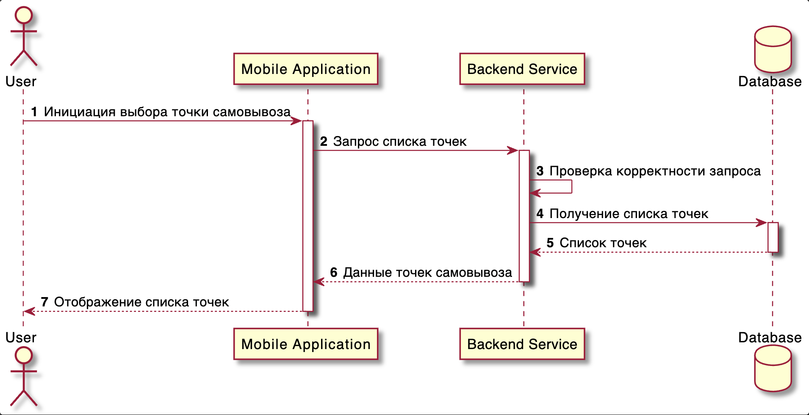

# ☕ Разработка фичи удаленного оформления заказа в сети кофеен «Дринкит» 

Учебный проект для портфолио, демонстрирующий навыки системного анализа и базового проектирования backend-части приложения кофейни с возможностью предзаказа и самовывоза.

---

## 📌 Цель проекта

Создать концепцию приложения кофейни, в котором пользователь может:
- выбрать точку самовывоза;
- заранее оформить заказ;
- забрать заказ без ожидания.

---

## User Story

**Как потребитель**,  
я хочу **оформлять заказ заранее, выбирая точку, откуда смогу его забрать**,  
чтобы **забирать заказ без ожидания**.

---

## Макет

---

### Use Case
Use Case описывает процесс выбора точки самовывоза и перехода к меню кофейни.

### Use Case — Выбор точки выдачи заказа

| Поле | Описание | Пример |
|-----|---------|--------|
| **Заголовок** | Краткое и ясное название сценария, описывающее задачу | Выбор точки выдачи заказа |
| **Акторы** | Кто взаимодействует с системой (пользователи или внешние системы) | Клиент |
| **Предусловие** | Состояние системы и пользователя перед началом сценария | Клиент авторизован в приложении кофейни |
| **Ограничения** | Факторы, которые могут повлиять на выполнение сценария | 1. Часы работы точек 2. Географическая доступность |
| **Триггер** | Событие, инициирующее сценарий | Клиент нажимает кнопку «Выбрать точку выдачи» |
| **Основной сценарий** | Последовательность основных шагов взаимодействия | 1. Клиент открывает экран выбора точки выдачи 2. Система отображает список доступных точек 3. Клиент выбирает точку 4. Система сохраняет выбор и подтверждает действие |
| **Альтернативный сценарий** | Поведение системы при отклонениях или ошибках | 1. Нет доступных точек поблизости 2. Точка временно закрыта |
| **Результат** | Состояние системы после успешного выполнения сценария | Выбранная точка выдачи сохранена в заказе |

---

### BPMN
BPMN-диаграмма отражает основной и альтернативные сценарии оформления предзаказа:
- основной (happy path);
- выбор точки через карту;
- недоступность точки самовывоза.

---

## Концептуальная модель предметной области

Верхнеуровневая концептуальная модель отражает основные сущности системы
и их взаимосвязи без привязки к технической реализации.

---

### ERD
ER-диаграмма описывает структуру данных приложения:
- пользователи;
- точки самовывоза;
- меню;
- заказы и позиции заказа.

---

### UML Sequence Diagram

Sequence-диаграмма отражает взаимодействие между клиентским приложением,
backend-сервисами и базой данных при выборе точки самовывоза.

Диаграмма включает:
- основной сценарий (успешный выбор точки);

| № шага | Описание шага |
|------|----------------|
| 1 | Пользователь нажимает кнопку **«Выбрать адрес»** в мобильном приложении. |
| 2 | Мобильное приложение отправляет **HTTP GET-запрос** на backend-сервис для получения списка доступных точек. |
| 3 | Backend-сервис выполняет валидацию полученного запроса. |
| 4 | Backend-сервис формирует и отправляет SQL-запрос в базу данных для получения списка точек. |
| 5 | База данных возвращает backend-сервису результат запроса с перечнем доступных точек. |
| 6 | Backend-сервис формирует и возвращает мобильному приложению HTTP-ответ **200 OK** с данными в формате JSON. |
| 7 | Мобильное приложение отображает пользователю экран со списком точек, доступных для выбора. |

---

## 🗄️ Модель данных

База данных реализована в **PostgreSQL**.  

---

## 🛠 Используемые инструменты и технологии

- PostgreSQL
- SQL
- BPMN 2.0
- UML
- ER-диаграммы
- REST API

---

## 📎 Статус проекта

Учебный проект для портфолио.  
Используется для демонстрации аналитических и проектных навыков.

