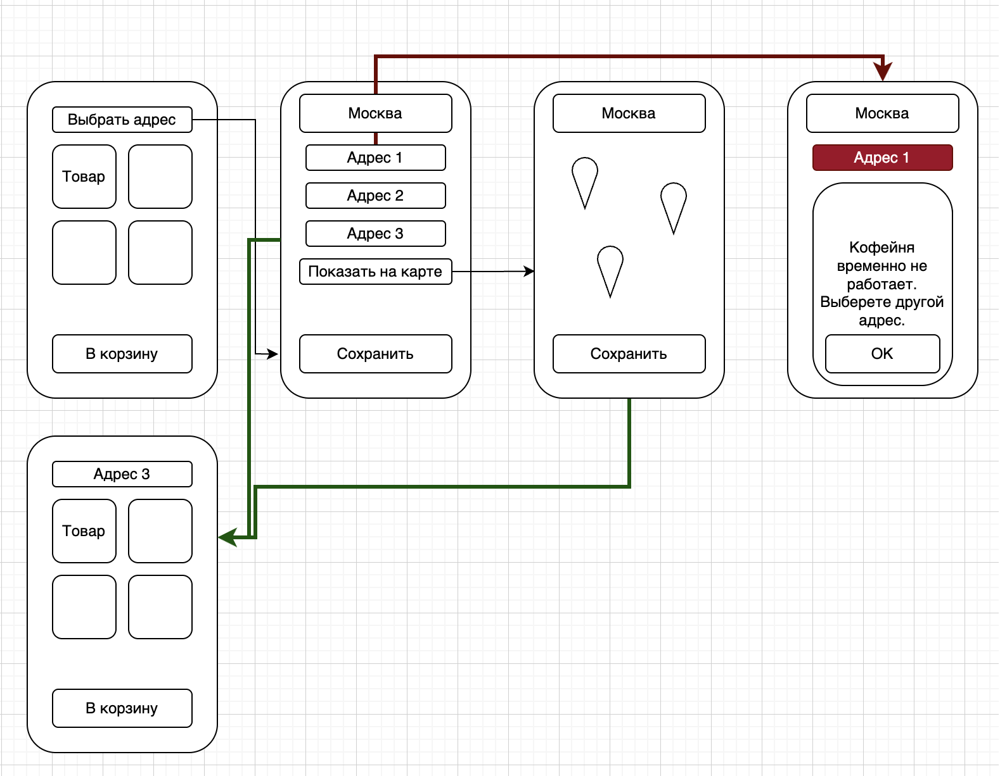

# ☕ Coffee App — учебный проект

Учебный проект для портфолио, демонстрирующий навыки системного анализа и базового проектирования backend-части приложения кофейни с возможностью предзаказа и самовывоза.

---

## 📌 Цель проекта

Создать концепцию приложения кофейни, в котором пользователь может:
- выбрать точку самовывоза;
- заранее оформить заказ;
- забрать заказ без ожидания.

---

## User Story

**Как потребитель**,  
я хочу **оформлять заказ заранее, выбирая точку, откуда смогу его забрать**,  
чтобы **забирать заказ без ожидания**.

---

## Макет

---

### Use Case
Use Case описывает процесс выбора точки самовывоза и перехода к меню кофейни.

📂 `docs/diagrams/use-case.drawio`  
📷 `docs/diagrams/use-case.png`

---

### BPMN
BPMN-диаграмма отражает основной и альтернативные сценарии оформления предзаказа:
- основной (happy path);
- выбор точки через карту;
- недоступность точки самовывоза.

📂 `docs/diagrams/bpmn-preorder-coffee.drawio`  
📷 `docs/diagrams/bpmn-preorder-coffee.png`

---

### UML Sequence Diagram

Sequence-диаграмма отражает взаимодействие между клиентским приложением,
backend-сервисами и базой данных при выборе точки самовывоза.

Диаграмма включает:
- основной сценарий (успешный выбор точки);
- обработку недоступной точки;
- обработку ошибки загрузки меню.

---

### ERD
ER-диаграмма описывает структуру данных приложения:
- пользователи;
- точки самовывоза;
- меню;
- заказы и позиции заказа.

📂 `docs/diagrams/erd.drawio`  
📷 `docs/diagrams/erd.png`

---

## 🗄️ Модель данных

База данных реализована в **PostgreSQL**.  
Диаграмма ERD была спроектирована и визуализирована с помощью **DBeaver**.

---

## 🛠 Используемые инструменты и технологии

- PostgreSQL
- DBeaver
- SQL
- BPMN 2.0
- UML
- ER-диаграммы
- REST API (концептуально)

---

## 📎 Статус проекта

Учебный проект для портфолио.  
Используется для демонстрации аналитических и проектных навыков.

